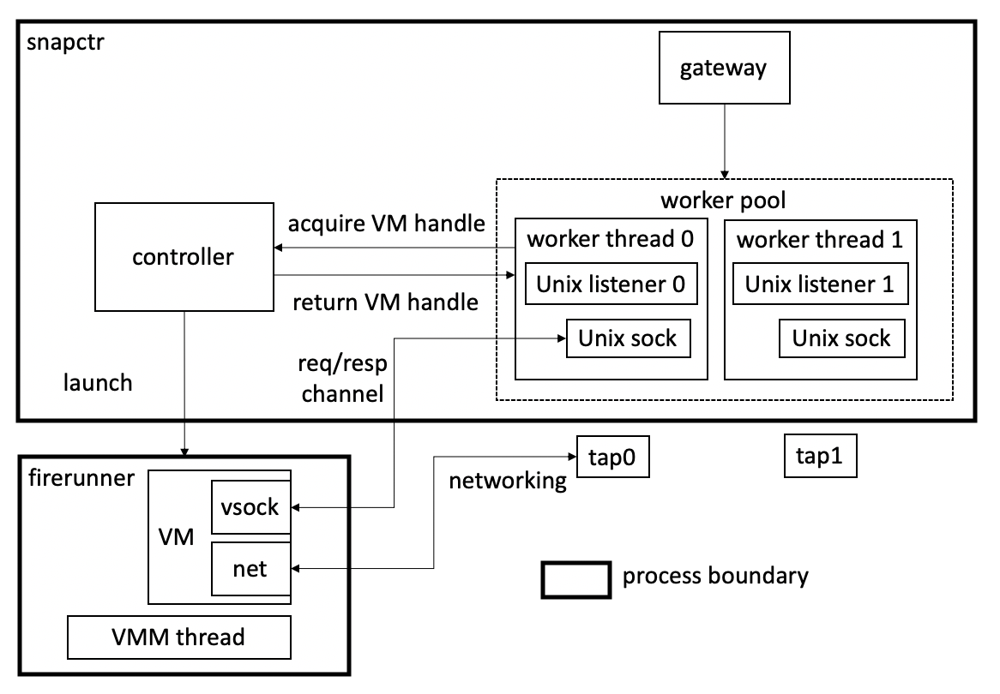

# `multivm` architecture


`multivm` currently statically registers all functions listed
in the function configuration file (e.g., `resources/example-function-configs.yaml`)
and assumes that all functions require the same VM size. It
statically creates `total memory/VM size` worker threads at
initialization time.

# Clean-up

Each worker thread holds at most one VM handle at a time. It
holds a unix domain socket that sends requests to and receives
responses from the VM. Such a connection is established by the
guest VM connects to the Unix domain socket listener unique to
each worker thread. All Unix domain socket listeners must be
removed after `multivm` exits (see the last line in `scripts/run-multivm-example.sh`).

# (Optional) Networking Setup
Each guest VM has the network interface `eth0` configured.
Each `eth0` is backed by a unique tap device pre-configured on
the host. Each tap device is associated with a worker thread.
`scripts/setup-tap-bridge.sh NUMBER_OF_TAPS` does the job.
In addition, `scripts/cleanup-taps.sh NUMBER_OF_TAPS` removes
all tap devices previously created.

# function configuration file

A function config file specifies:

```txt
name: function name
runtimefs: root filesystem name, expected to be under `runtimefs_dir` specified in controller config file.
appfs: application filesystem name, expected to be under `appfs_dir` specified in controller config file.
vcpus: number of vcpus,
memory: VM memory size,
concurrency_limit: not in use
copy_base: whether copy base snapshot memory dump
copy_diff: whether copy diff snapshot memory dump
load_dir: **optional**, base snapshot name, expected to be under `snapshot_dir` specified in controller config file.
diff_dirs: **optional**, comma-separated list of diff snapshot names, expected to be under `snapshot_dir`/diff
```

Note that "optional" means that the fields do not need to
exist. If load_dir and diff_dirs exist, then the function is
booted from its base + diff snapshots. If they are missing,
then the function goes through the regular boot process.
